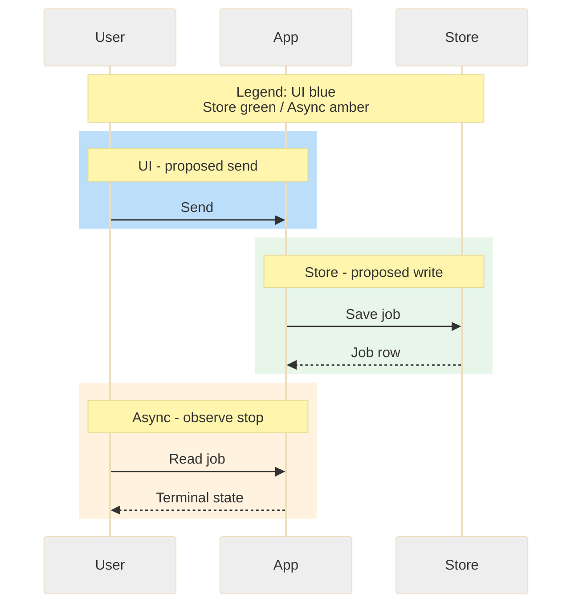

# Diagram conventions

Mermaid is the durable source. Keep fat-marker boundaries, short labels, meaningful
edges and at most eight sequence participants unless split with explicit coverage.
Distinguish in-process calls from network interfaces. Source evidence or an explicit
proposal accompanies every node, edge and control; never invent component internals.

| Role | Fill | Stroke | Text |
| --- | --- | --- | --- |
| Primary service | #326ce5 | #1a3e7a | #ffffff |
| Internal component | #4fc3f7 | #0277bd | #01579b |
| Client | #e3f2fd | #1565c0 | #0d47a1 |
| UI | #bbdefb | #1565c0 | #0d47a1 |
| Data/store | #e8f5e9 | #2e7d32 | #1b5e20 |
| Security | #fce4ec | #c62828 | #b71c1c |
| Async | #fff3e0 | #e65100 | #bf360c |

Use a legend and semantic boundary labels, not colors alone. Prefer LR for flows
and TB for hierarchies where legible. Long flows should pan/zoom or split with
complete coverage; do not shrink important labels into unreadability.

Observed Mermaid 11.17.2 lessons: raw semicolons in sequence message text caused
parse failures; short text and explicit line breaks fixed note overflow. Theme
selectors must be verified against rendered pixels; syntactically accepted styling
may have no effect. These are compatibility observations, not universal syntax
prohibitions. Never count parser success alone as visual validation.

## Limited sequence renderer

For the workshop's documented renderer profile, keep sequence.mmd as a real
sequenceDiagram, use short labels on a white background, and omit alt/else blocks.
Represent failure branches as separately captioned true sequence diagrams or
short messages with complete semantic coverage. Use the role palette for fills.
Actor boxes stay one gray fill on this renderer even when role styling is valid;
record that limit and use colored message bands (Mermaid rect blocks) with role
labels and a legend. No claim that actor colors changed without pixel inspection.

This is an illustrative proposed sequence, not evidence of existing product
behavior. Changing colors for a documented renderer limit may not change the
diagram type. Render source-bound SVG/PNG and require the independent reviewer
to open all pixels and check the actual event ordering and requested stop.
