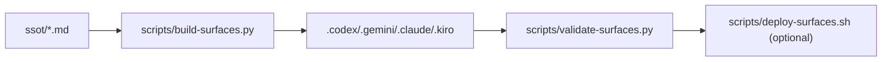

# Core-Prompts

Ship better AI work with prompts that are reusable, structured, and easy to run.

Core-Prompts is a practical prompt system for real workflows: prompt engineering, synthesis, planning, context analysis, and handoff. You can use the prompts directly, or maintain them as SSOT and generate CLI-specific surfaces.

## Start In 2 Minutes

```bash
git clone https://github.com/medhatgalal/Core-Prompts.git
cd Core-Prompts
python3 scripts/build-surfaces.py
python3 scripts/validate-surfaces.py --strict
```

Optional local deployment to your CLI homes:

```bash
scripts/deploy-surfaces.sh --cli all
```

## Why This Is Valuable

- Faster execution: fewer vague prompts, fewer retries.
- Better outputs: structure, constraints, and quality gates are built in.
- Cross-tool portability: one SSOT source generates Codex, Gemini, Claude, and Kiro surfaces.
- Safer changes: deterministic build + validation + deploy workflow.

## Prompt Set

| Prompt | Primary Value | Typical Use |
|---|---|---|
| `supercharge` | Multi-pass prompt hardening | Improve prompts, plans, and specs with explicit lenses |
| `converge` | Strong synthesis | Merge multiple docs/sessions into one decision-ready direction |
| `mentor` | Senior engineering guidance | Decide next actions, de-risk execution, improve process |
| `analyze-context` | Iterative analysis workflow | Audit many files/items while preserving working memory |
| `threader` | Context export | Create a clean transcript handoff for another AI/session |

## Full Run Examples (One For Each Prompt)

These are full workflow examples with command + expected outcome. Invocation prefix differs by tool (`$supercharge`, `/supercharge`, etc.), but the run intent is the same.

### 1) `supercharge` full run

**Goal:** Turn a rough prompt into a robust execution prompt.

**Run:**

```text
supercharge /ult /realism Improve this prompt:
"Design our docs strategy."
```

**Expected result:**

- Returns a copy-ready improved prompt.
- Executes it immediately and returns output under clear sections.
- Surfaces constraints/assumptions instead of inventing context.

### 2) `converge` full run

**Goal:** Merge three competing drafts into one final plan.

**Run:**

```text
converge intent: "Choose one docs strategy for Q2."
source A: <paste>
source B: <paste>
source C: <paste>
```

**Expected result:**

- Produces a single stronger proposal, not a stitched summary.
- Makes trade-offs explicit.
- Calls out unresolved decisions and a recommended path.

### 3) `mentor` full run

**Goal:** Decide what to do next after a failed validation.

**Run:**

```text
/mentor Validation failed after my SSOT edits. Here is output: <paste>
```

**Expected result:**

- Triage of likely causes.
- Recommended recovery sequence.
- Clear "do this next" checklist with risk controls.

### 4) `analyze-context` full run

**Goal:** Audit prompt consistency across many files.

**Run:**

```text
Use analyze-context to audit all ssot/*.md files for duplicated rules and drift.
```

**Expected result:**

- Creates memory files under `.analyze-context-memory/`.
- Tracks progress item-by-item.
- Produces a final findings summary with actionable fixes.

### 5) `threader` full run

**Goal:** Export a complete thread for continuation in another model.

**Run:**

```text
/threader export
```

**Expected result:**

- Produces a transcript file when supported.
- Falls back to inline transcript mode if file creation is not supported.
- Preserves ordering and context for handoff.

## Quick AI Handoff (Copy/Paste)

```text
You are working in /Users/medhat.galal/Desktop/Core-Prompts.
This repo is prompt-first. Source of truth is ssot/.
If behavior changes are needed, edit ssot files first, then run:
1) python3 scripts/build-surfaces.py
2) python3 scripts/validate-surfaces.py --strict
Do not hand-edit generated files under .codex/.gemini/.claude/.kiro.
```

## How The Repo Works



## Docs Organization

- Start here: [docs/README.md](docs/README.md)
- Fast onboarding: [docs/GETTING-STARTED.md](docs/GETTING-STARTED.md)
- Full run examples: [docs/EXAMPLES.md](docs/EXAMPLES.md)
- Technical reference: [docs/README_TECHNICAL.md](docs/README_TECHNICAL.md)
- CLI details: [docs/CLI-REFERENCE.md](docs/CLI-REFERENCE.md)
- Architecture: [docs/ARCHITECTURE.md](docs/ARCHITECTURE.md)
- Troubleshooting: [docs/FAQ.md](docs/FAQ.md)
- Docs prompt-pack: [docs/prompt-pack/README.md](docs/prompt-pack/README.md)

## Release Packaging

```bash
scripts/package-surfaces.sh --version vX.Y.Z
```

Creates release bundles in `dist/` (`.tar.gz` and `.zip`).
