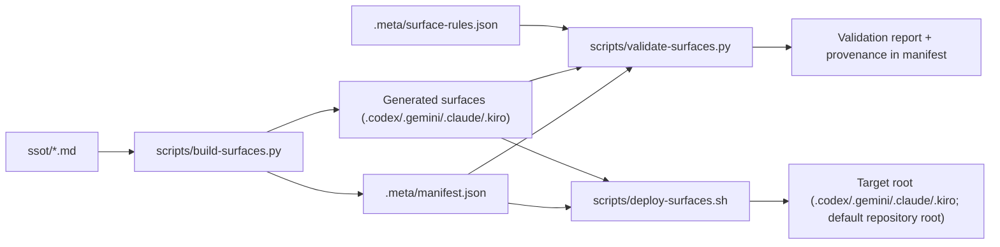

# Architecture

This repository uses an SSOT-first architecture for generating and validating multi-CLI surfaces.

## Core Model

- Source of truth: `ssot/*.md`
- Rule policy: `.meta/surface-rules.json`
- Generated artifact map: `.meta/manifest.json`
- Generated surfaces:
  - `.codex/`
  - `.gemini/`
  - `.claude/`
  - `.kiro/`

## Build and Validation Pipeline

## Script Responsibilities

- `scripts/build-surfaces.py`
  - reads SSOT files
  - emits generated surfaces
  - writes manifest entries for slugs and artifacts
- `scripts/validate-surfaces.py`
  - validates generated artifacts against `.meta/surface-rules.json`
  - checks manifest consistency with SSOT
  - optionally runs CLI-backed validation and schema cache checks
- `scripts/deploy-surfaces.sh`
  - copy-only deployment to target root paths
  - no symlink creation
  - replaces destination symlinks with regular file copies

## Codex Agent Generation and Registration

- Skills are generated under `.codex/skills/<slug>/SKILL.md`.
- For SSOT entries marked `kind: agent` or `role: agent`, agent config is generated under `.codex/agents/<slug>.toml`.
- Deployment updates `<target>/.codex/config.toml` with managed `[agents.<slug>]` entries that point to generated agent TOML files.

## Safety and Change Boundaries

- Edit behavior in SSOT files only.
- Do not hand-edit generated per-CLI artifacts.
- Keep deployment copy-only and auditable.
