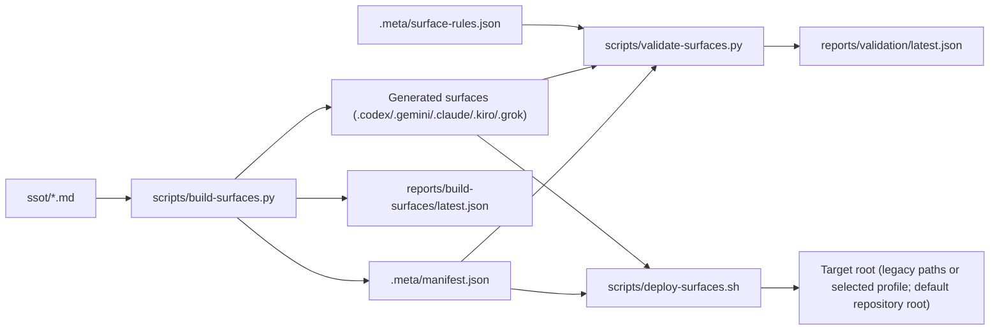

# Architecture

This repository uses an SSOT-first architecture for generating and validating multi-CLI surfaces.

## Core Model

- Source of truth: `ssot/*.md`
- Rule policy: `.meta/surface-rules.json`
- Generated artifact map: `.meta/manifest.json` (content-stable canonical inventory)
- Generated run evidence: `reports/build-surfaces/` and `reports/validation/`
- Generated surfaces:
  - `.codex/`
  - `.gemini/`
  - `.claude/`
  - `.kiro/`
  - `.grok/`

## Build and Validation Pipeline

```mermaid
flowchart LR
  A["ssot/*.md"] --> B["scripts/build-surfaces.py"]
  B --> C["Generated surfaces (.codex/.gemini/.claude/.kiro/.grok)"]
  B --> D[".meta/manifest.json"]
  B --> J["reports/build-surfaces/latest.json"]
  E[".meta/surface-rules.json"] --> F["scripts/validate-surfaces.py"]
  C --> F
  D --> F
  F --> G["reports/validation/latest.json"]
  C --> H["scripts/deploy-surfaces.sh"]
  D --> H
  H --> I["Target root (legacy paths or selected profile; default repository root)"]
```

## Script Responsibilities

- `scripts/build-surfaces.py`
  - reads SSOT files
  - emits generated surfaces
  - writes the canonical manifest entries for slugs and artifacts
  - emits ignored build provenance under `reports/build-surfaces/`
- `scripts/validate-surfaces.py`
  - validates generated artifacts against `.meta/surface-rules.json`
  - checks manifest consistency with SSOT
  - optionally runs CLI-backed validation and schema cache checks
  - emits ignored validation provenance under `reports/validation/`
- `scripts/deploy-surfaces.sh`
  - copy-only deployment to target root paths
  - no symlink creation
  - legacy deployment replaces destination file symlinks with regular copies
  - profile deployment preserves unknown or customized packages and rejects unsafe symlink boundaries; see [Installation Profiles](INSTALL-PROFILES.md)

## Codex Agent Generation and Registration

- Skills are generated under `.codex/skills/<slug>/SKILL.md`.
- Canonical `capability_type: agent` or `both` entries emit `.codex/agents/<slug>.toml`; the artifact matrix in `.meta/surface-rules.json` determines surface eligibility.
- Generated Codex agent TOMLs are runtime metadata plus instructions only:
  - `name`
  - `description`
  - `sandbox_mode`
  - `developer_instructions`
- Do not emit legacy top-level `tools = [...]` arrays in Codex agent TOMLs; current Codex runtime rejects that schema.
- Deployment that includes agents updates `<target>/.codex/config.toml` with managed `[agents.<slug>]` entries. The selected skills-only profile does not alter agent registrations.
- Repository skills remain under `.codex/skills`; the selected Codex home profile installs them under `.agents/skills`. See [Installation Profiles](INSTALL-PROFILES.md).

## Safety and Change Boundaries

- Edit capability bodies in `ssot/` and helpers in their canonical resource directories, following the [same-slug UAC flow](UAC-USAGE.md#update-an-existing-capability).
- Do not hand-edit generated per-CLI artifacts.
- Keep deployment copy-only and auditable.
