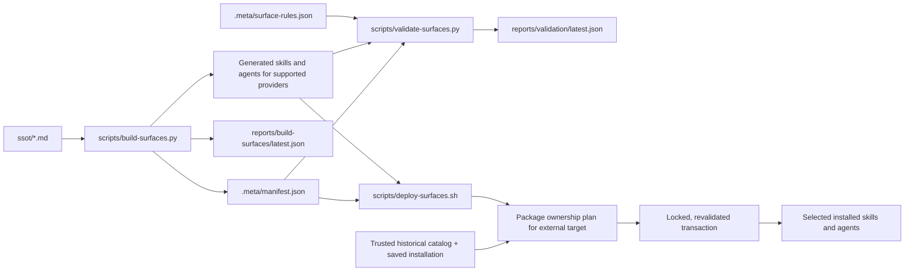

# Architecture

This repository uses an SSOT-first architecture for generating and validating multi-CLI surfaces.

## Core Model

- Source of truth: `ssot/*.md`
- Rule policy: `.meta/surface-rules.json`
- Generated artifact map: `.meta/manifest.json` (content-stable canonical inventory)
- Generated run evidence: `reports/build-surfaces/` and `reports/validation/`
- Generated surfaces:
  - `.codex/`
  - `.gemini/`
  - `.claude/`
  - `.kiro/`
  - `.grok/`

## Build and Validation Pipeline

```mermaid
flowchart LR
  A["ssot/*.md"] --> B["scripts/build-surfaces.py"]
  B --> C["Generated skills and agents for supported providers"]
  B --> D[".meta/manifest.json"]
  B --> J["reports/build-surfaces/latest.json"]
  E[".meta/surface-rules.json"] --> F["scripts/validate-surfaces.py"]
  C --> F
  D --> F
  F --> G["reports/validation/latest.json"]
  C --> H["scripts/deploy-surfaces.sh"]
  D --> H
  H --> P["Package ownership plan for external target"]
  K["Trusted historical catalog + saved installation"] --> P
  P --> T["Locked, revalidated transaction"]
  T --> I["Selected installed skills and agents"]
```

## Script Responsibilities

- `scripts/build-surfaces.py`
  - reads SSOT files
  - emits generated surfaces
  - writes the canonical manifest entries for slugs and artifacts
  - emits ignored build provenance under `reports/build-surfaces/`
- `scripts/validate-surfaces.py`
  - validates generated artifacts against `.meta/surface-rules.json`
  - checks manifest consistency with SSOT
  - optionally runs CLI-backed validation and schema cache checks
  - emits ignored validation provenance under `reports/validation/`
- `scripts/deploy-surfaces.sh`
  - routes external targets to the same installation engine used by repair and routine update
  - previews JSON plans and preserves customized, incomplete, and symlinked packages
  - retains repository-local generated-surface compatibility separately

## Installation engine

Canonical runtime source is modular under `scripts/core_install/`:

| Module | Responsibility |
| --- | --- |
| `catalog.py` | Read trusted, complete historical package identities without requiring an old updater or receipt. |
| `providers.py` | Preserve provider/surface identity, map layouts, resolve dependencies, and propose conservative registration edits. |
| `planner.py` | Reconcile selected packages and resources; report operation and installation-wide conflicts separately. |
| `transaction.py` | Lock, revalidate, save preimages/postimages, apply, verify, and recover with later-edit protection. |
| `cli.py` | Adapt install, repair, preview, apply, and recovery commands to the shared engine. |
| `profile_v1.py` | Retain older bootstrap/recovery APIs; refuse operations underneath active newer installation state. |

`scripts/build-install-runtime.py` compiles those sources into the generated
`scripts/deploy-profile.py` capsule. This keeps the distribution within older
updaters' permitted paths while allowing modular maintenance. CI checks source
and capsule parity. The historical catalog is generated from verified release
refs; neither target-local manifests nor matching names establish ownership.

The installation record persists provider, surface, and slug selection together
with file ownership. Journals contain exact recovery images. Release-watch
observations are operational state: rollback can preserve later polling data
while restoring the installed version. See [installation and recovery](INSTALL-PROFILES.md)
for supported upgrade paths and conflict behavior.

## Codex Agent Generation and Registration

- Skills are generated under `.codex/skills/<slug>/SKILL.md`.
- For SSOT entries marked `kind: agent` or `role: agent`, agent config is generated under `.codex/agents/<slug>.toml`.
- Generated Codex agent TOMLs are runtime metadata plus instructions only:
  - `name`
  - `description`
  - `sandbox_mode`
  - `developer_instructions`
- Do not emit legacy top-level `tools = [...]` arrays in Codex agent TOMLs; current Codex runtime rejects that schema.
- Deployment updates `<target>/.codex/config.toml` only for selected, recognized agent packages; custom registrations are preserved with their dependent files.

## Safety and Change Boundaries

- Edit capability behavior in SSOT; edit installation runtime behavior in `scripts/core_install/` and regenerate its capsule.
- Do not hand-edit generated per-CLI artifacts.
- Keep deployment copy-only and auditable.
