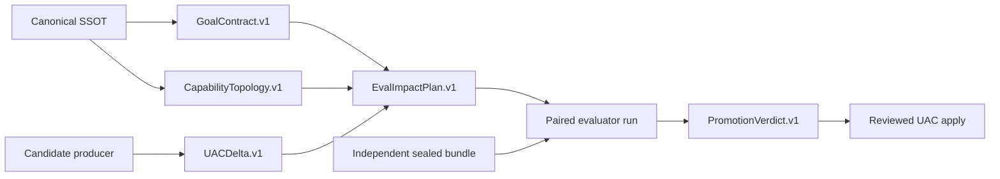

# Capability Evaluation

Core-Prompts separates candidate production from behavioral promotion.

## Ownership

- UAC owns deterministic intake, overlap analysis, structural readiness, clarity diagnostics, candidate generation, and impact planning.
- `instruction-editor` owns auditable editorial candidates and preservation maps.
- Auto-Research owns behavioral experiments and promotion decisions.
- `capability-eval` enforces repo-owned contracts, profiles, budgets, evidence binding, and fail-closed statuses.
- Inspect AI, Inspect SWE, and direct host adapters are interchangeable execution mechanisms, not truth oracles.

## Evidence flow

`structural_ready` is not `promote`. No score can compensate for a failed safety, authority, routing, state, output, resource, handoff, or critical-mutation gate.

## Selective profiles

| Profile | Model calls | Hard raw-token cap | Intended use |
| --- | ---: | ---: | --- |
| `static` | no | 0 | contracts, topology, schemas, clarity lint, deterministic controls |
| `native` | no | 0 | CLI availability, version, validation, and discovery probes |
| `routing-canary` | yes | 0.3M | name, description, invocation-hint changes |
| `canary` | yes | 1.25M | bounded module or shared-engine changes |
| `promotion` | yes | 5M | new skills and behavior, safety, state, authority, or merge proof |
| `cross-host` | yes | 12M | required deployment-envelope evidence |
| `sweep` | yes | 30M | explicitly approved model, effort, and host research |

Reaching a cap returns `inconclusive`. The runner cannot silently reduce trials or omit cells.

## Current rollout state

Enforcement is advisory. All 24 current capabilities have draft Goal Contracts and draft or blocked topologies. Draft extraction is not human approval: every normative clause must be mapped to a case or reviewed waiver before topology closure.

The public evaluator controls are present, but semantic judges are not yet qualified and the sealed promotion bundle is absent. Live provider execution therefore remains disabled. This is deliberate: the foundation can reject false proof before it spends tokens.

The six-skill pilot is SuperCharge, Pulse, Code Review, Weekly Intel, UAC Import, and Architecture. Instruction Editor has a separate routing and preservation corpus.

## Google-style experiment

`instruction_clarity.v1` is a source-linked local policy that summarizes selected Google developer documentation guidance. It does not weaken UAC's HTML ingestion boundary and does not copy the full style guide.

The causal experiment has four blinded arms: baseline, UAC without clarity, clarity only, and UAC plus clarity. Human clarity and behavioral fitness remain separate scorecards. Default rewriting stays off until the sealed, powered ablation proves human gain, behavioral non-inferiority, routing preservation, critical-mutation coverage, and holdout survival.

## Evidence staleness

A verdict binds baseline, candidate, Goal Contract, topology, dataset, scorer, evaluator, adapter, CLI, model, effort, tool-policy, and runtime hashes or versions. Any bound change makes the verdict `stale_evidence`; historical records remain intact but cannot authorize a new apply.
