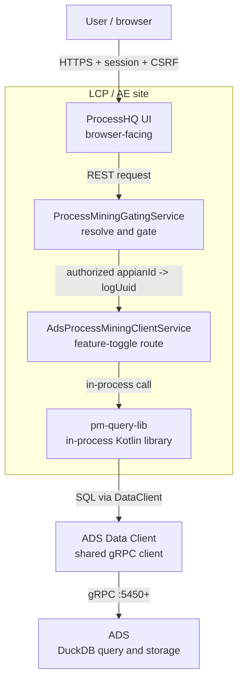
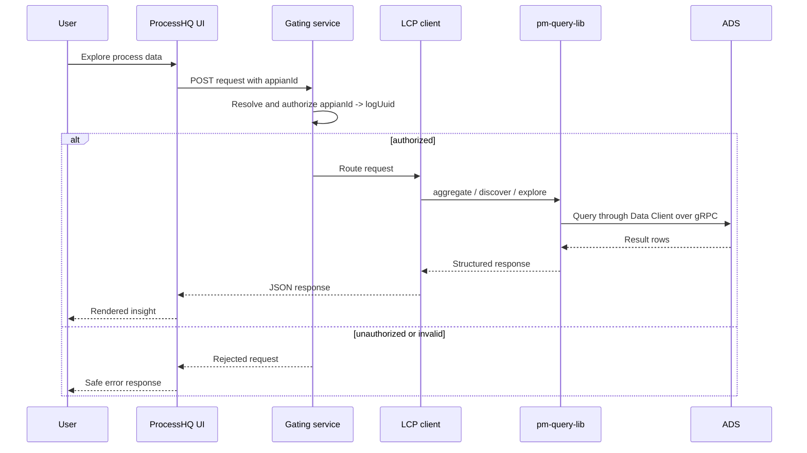

# HTML Docs Surface Receipt

Artifact: `pm-query-lib-architecture-2026-09-17`

Adapter: `mermaid-markdown-passthrough`

Status: `passthrough`

The HTML/Markdown surface consumes the same source bundle without image
hosting. The rendered page is represented by
`reports/engos-shaping-rails/html-surface.html`; its Mermaid blocks and tables
are sourced from `exercise-source/` without semantic edits.

## Architecture Diagram



## Request Sequence



## Contract and security tables

See [contracts](exercise-source/contracts.md) and
[security owners](exercise-source/security-owners.md). Their rows are included
unchanged in the HTML build fixture.

## Receipt

```text
source_hash: computed from exercise-source/manifest.json and referenced files
representation: mermaid_markdown + markdown_tables
placement_status: passthrough
verified_by: local rendered HTML screenshot and DOM assertions
changed_meaning: false
```
